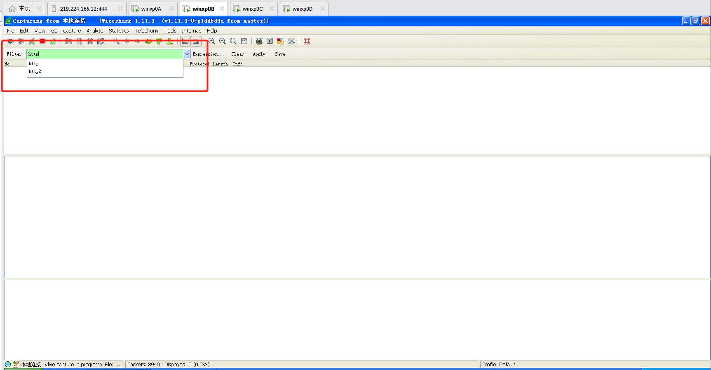
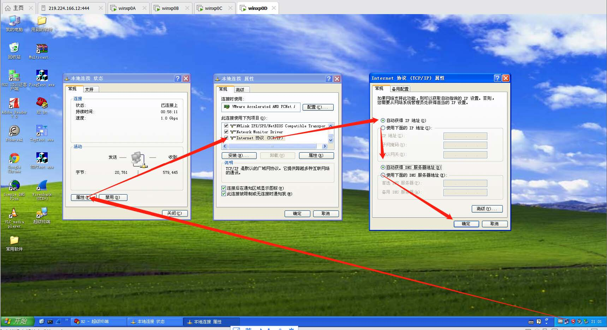

## 网络实验入门

> 作者：蒋博文

### 1

- 根据多方调查，基本上没人找出怎么对应的接口，就直接截了`display current-configuration`
  之后的截图(根本就不显示GE那个接口只有E打头和S打头的接口)
- R1 截图：打开winxp2C ，双击R1.ht ,回车，输入`display current-configuration`，然后一路
  回车可以看更多的信息，截图即可
- R2 截图：打开winxp2D 操作同R1 。

### 2

- 进入超级终端R1.ht ，刚开始前面是`<R1>` ,然后敲`system-view` ，前面变成`[R1]` ，这是系统视
  图；然后敲`interface Ethernet 0/0` ，然后前面变成[R1 Ethernet 0/0] ，这是接口视图，然
  后输入`shutdown`关闭，在输入`undo shutdown`开启，截图即可。
- 顺便提一句，进入视图之后，想要返回上一级视图用quit命令。

### 3

打开WireShark->点击本地连接， start->选择filter为http

打开“连线组网软件”->点击“主网联机”->按照如下图操作设为自动连接。

打开“我的电脑”，在目录处输入www.baidu.com ，然后在WireShark双击一条报文进行查看，然后填表就行。

### 4

观看mooc视频1.6，照着做就行。

### 5

做了4你就知道5怎么做了

### 6

没做

### 7

