## 网络层实验

> 本实验默认你已进行过入门实验，了解一些基本操作，尽管『jbw-入门教程』十分差劲

开始实验前，打开超级终端，运行`reset save`、`reboot`恢复初始设置，前者直接y，后者先n后y。

### ARP报文分析

打开连线组网软件，组网如下，完成后提交。

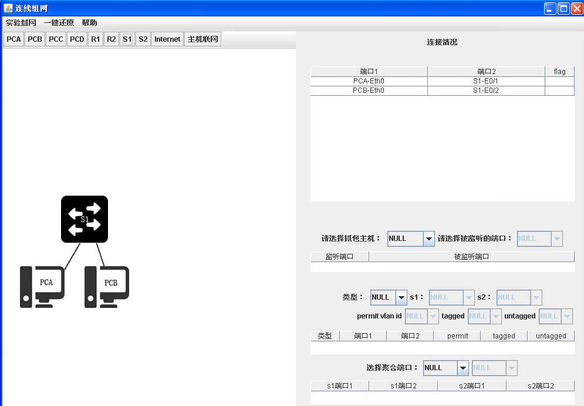

接着配置PCA和PCB的IP地址。PCA：


PCB：

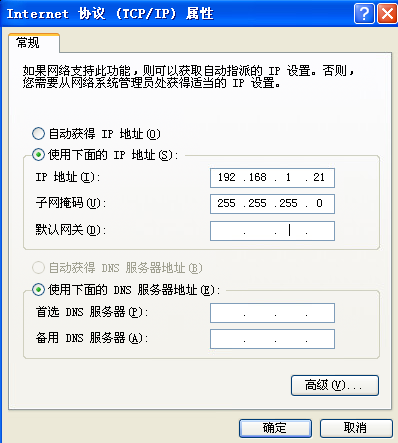

后，依次执行：打开PCA、PCB的cmd，输入`arp -a`。

> 题1表格第一部分，即2.6.1中步骤2中的执行结果
>
> | 输入命令      | 结果                                                        |
> | ------------- | ----------------------------------------------------------- |
> | PCA中`arp -a` | 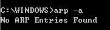 |
> | PCB中`arp -a` | 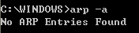 |

若上述步骤中，结果不是`No ARP`，则需要输入`arp -d`清空。

然后打开PCA和PCB的Wireshark，如下图点击配置，注意IP要选择刚刚设置的IP。

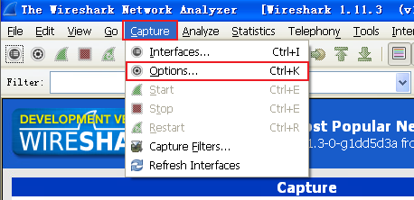

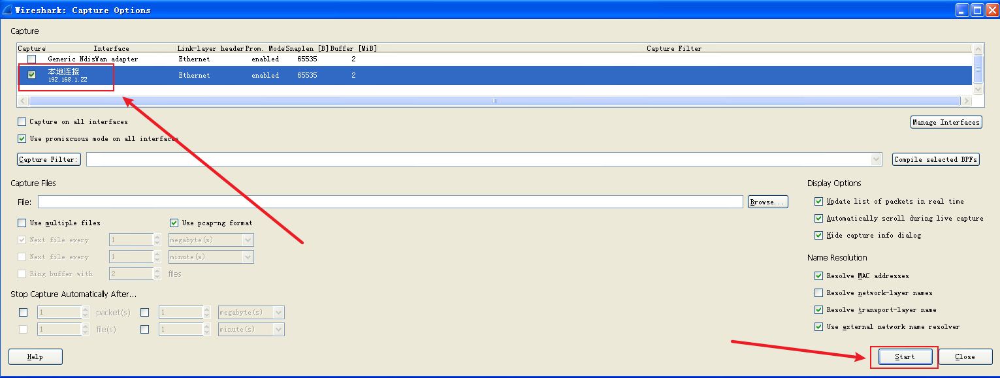

PCA和PCB都如上图一样配置，然后打开PCA的cmd窗口，输入`ping 192.168.1.21`，ping PCB。

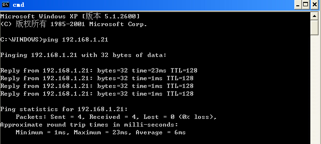

后停止PCA和PCB的Wireshark对报文的截获，总体截图(包含ARP+ICMP)用于题2，在PCA中点击第一条和第二条ARP，展开链路层和网络层截图，用于题3。

> 题2：
>
> 答：报文截获结果如下：
>
> [截图]
>
> 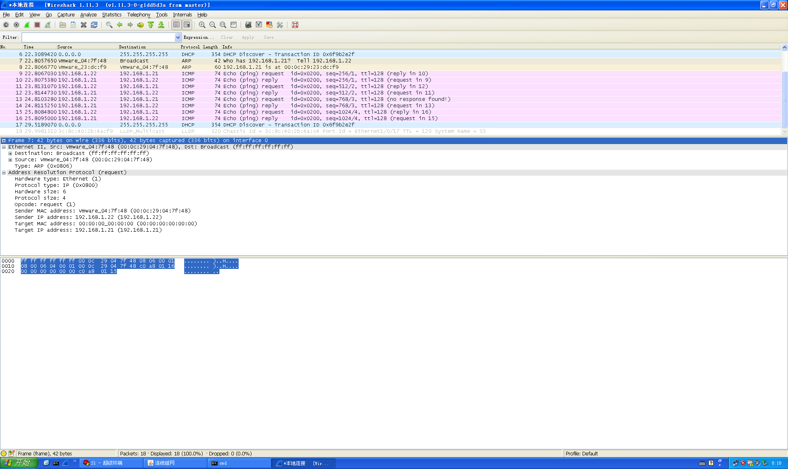
>
> 有2个ARP报文，8个ICMP报文，”Opcode“字段值为1代表request，2代表reply


> 题3：
>
> [截图×2]第一条ARP请求报文和第一条ARP应答报文
>
> 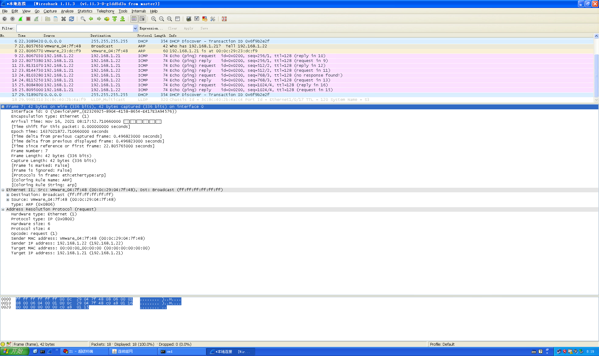
>
> 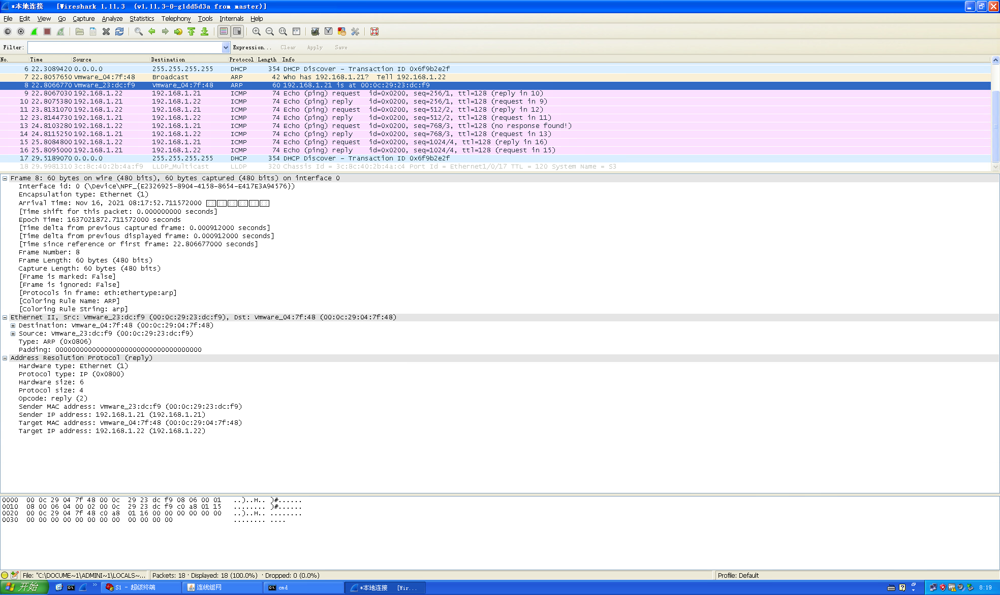
>
> | 字段项                   | ARP请求数据报文 | ARP应答数据报文 |
> | ------------------------ | --------------- | --------------- |
> | 链路层Destination项      |                 |                 |
> | 链路层Source项           |                 |                 |
> | 网络层Sender MAC Address |                 |                 |
> | 网络层Sender IP Address  |                 |                 |
> | 网络层Target MAC Address |                 |                 |
> | 网络层Target IP Address  |                 |                 |

点击Ctrl+S保存报文信息，保存PCA和PCB的报文，命名为`ping1-学号`，方便后续分析。

接下来，打开PCA、PCB的cmd，输入`arp -a`查看。

> 题1第二部分，即2.6.1中步骤4中的执行结果，填入截图（**如果此时arp -a没能出现列表，就再ping一次即可，好像还有时间要求，几次ping不要隔太久**）
>
> | 输入命令      | 结果                                                        |
> | ------------- | ----------------------------------------------------------- |
> | PCA中`arp -a` | 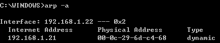 |
> | PCB中`arp -a` | 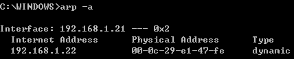 |

之后重新运行PCA和PCB的wireShark，在PCA中ping 192.168.1.21，后停止wireShark并保存报文为`ping2-学号`。打开ping1和ping2对比，将ping2报文截图，在ping2中filter`arp`再截图一张。

> 题4(1)：
>
> 答：少了ARP报文。原因是ARP缓存已经保存下了上一次ARP报文的内容，也就是PCB的MAC地址。所以在这一次的ping中，PCA不再需要用ARP询问PCB的MAC地址。ARP缓存可以保存之前收到的ARP回复，减少ARP请求的次数。
>
> [此处要有截图两张]
>
> 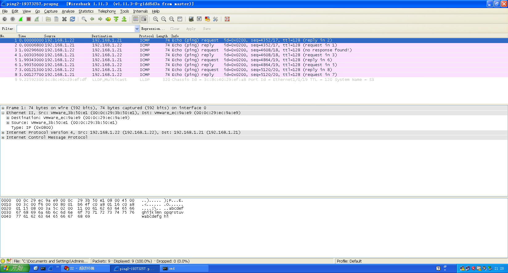
>
> 

重新组网连线，组网如下，连接后提交。

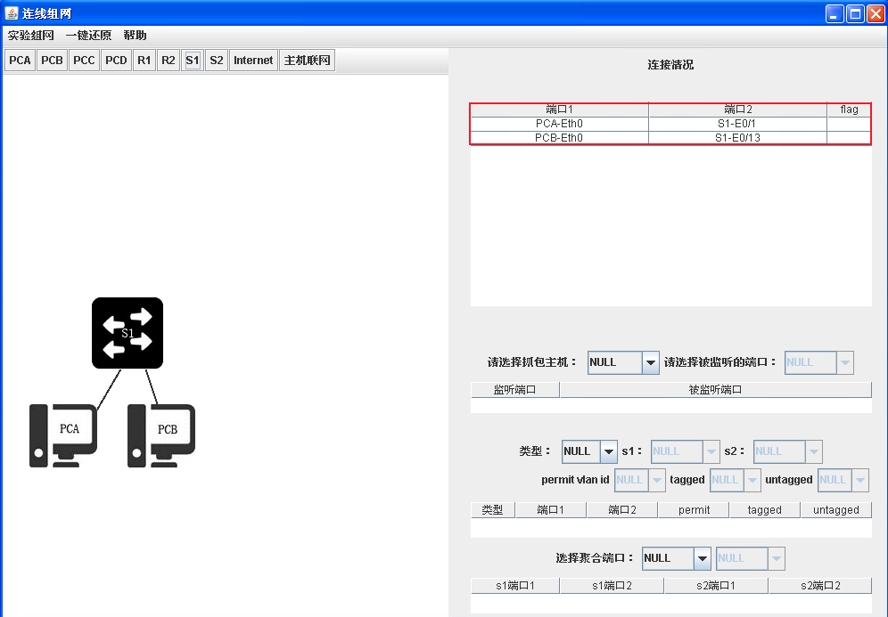

设置PCA和PCB的默认网关。PCA：


PCB：

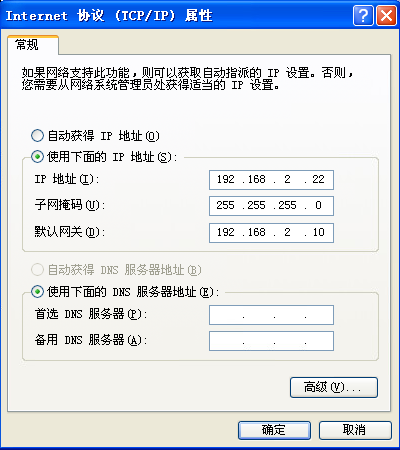

> 题4(2):按照图-4重新进行组网，并确保连线正确。修改计算机的IP地址，并将PC A的默认网关修改为192.168.1.10，PC B的默认网关修改为192.168.2.10。考虑如果不设置默认网关会有什么后果？
>
> 答：如果不设置默认网关，那么PCA ping PCB时发现PCB不在同一局域网后，由于没有默认网关，也就无法交给默认网关转发，最后只能放弃发送，ping不通。

在PCA的超级终端中，输入以下命令设置VLAN2和VLAN3：

```shell
<S1>sys
[S1]vlan 2
[S1-vlan2]port e 1/0/1
[S1-vlan2]inter vlan2
[S1-Vlan-interface2]ip add 192.168.1.10 255.255.255.0
[S1-Vlan-interface2]vlan 3
[S1-vlan3]port e 1/0/13
[S1-vlan3]inter vlan3
[S1-Vlan-interface3]ip add 192.168.2.10 255.255.255.0
```

然后类似上面的部分步骤，打开WireShark，选择本地设置的IP，运行，然后在PCA中ping 192.168.2.22。执行完后，停止PCA和PCB的截获，将报文信息保存为`ping3-学号`。并在PCA和PCB中分别点击第一条ARP展开链路层和网络层，查看详情并截图。

> 题5：
>
> 答：截获的ARP报文内容如下：PCA请求报文：
>
> 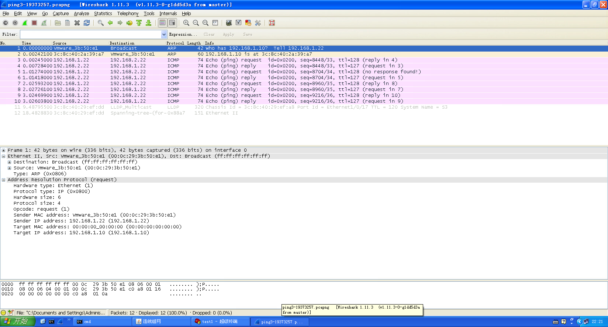
>
> PCB应答报文：
>
> 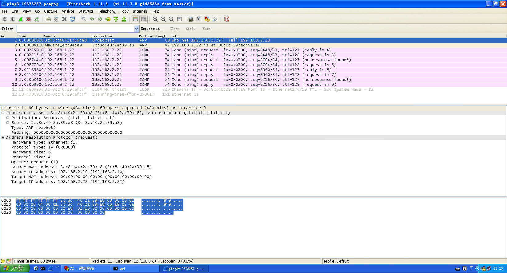
>
> 根据上图报文，填写表格：
>
> | 字段项                   | ARP请求数据报文 | ARP应答数据报文 |
> | ------------------------ | --------------- | --------------- |
> | 链路层Destination项      |                 |                 |
> | 链路层Source项           |                 |                 |
> | 网络层Sender MAC Address |                 |                 |
> | 网络层Sender IP Address  |                 |                 |
> | 网络层Target MAC Address |                 |                 |
> | 网络层Target IP Address  |                 |                 |
>
> 此时ARP请求的目标的IP地址为PCA默认网关的地址，而不是PCB的地址。
>
> 1. 区别：相同网段下，ARP会直接请求目标的MAC地址；不同网段下，ARP会请求他的默认网关的MAC地址。
>
> 2. 相同点：都各有一个ARP请求和应答报文，请求的发送者和应答的接收者都是同一台主机。

在执行完ping后，在PCA和PCB的cmd中输入`arp -a`，截图，填入第一题第三部分中。

> 题1第三部分，即2.6.2中步骤3中的执行结果，填入截图
>
> | 输入命令      | 结果                                                        |
> | ------------- | ----------------------------------------------------------- |
> | PCA中`arp -a` | 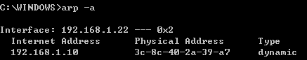 |
> | PCB中`arp -a` | 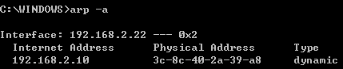 |

### ICMP报文分析

连线组网，提交：

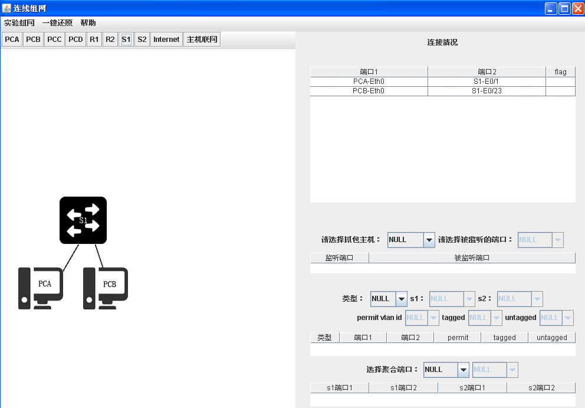

修改PCA的IP：


修改PCB的IP：

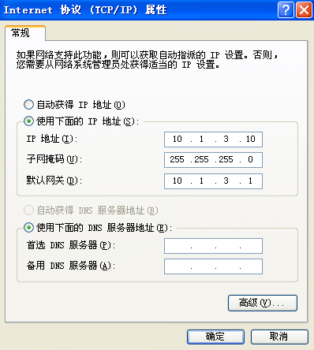

打开PCA的终端，输入：

```shell
<S1>sys
[S1]vlan 2
[S1-vlan2]port e 1/0/1
[S1-vlan2]inter vlan2
[S1-Vlan-interface2]ip add 10.1.2.1 255.255.255.0
[S1-Vlan-interface2]vlan 3
[S1-vlan3]port e 1/0/23
[S1-vlan3]inter vlan3
[S1-Vlan-interface3]ip add 10.1.3.1 255.255.255.0
```

接着类似前面，打开wireshark运行，在PCA中ping 10.1.3.10，停止截获并保存，filter“icmp”并截图总体ICMP报文图，并在PCA中截图第一个ICMP发送和回应的详情，进行分析。

> 题6：共有 8 个ICMP报文
>
> 答：以下是PCA截获报文结果：
>
> 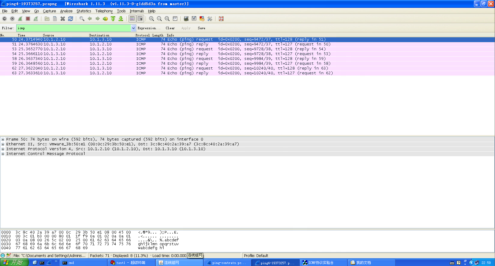
>
> 第一条ICMP回送请求报文：
>
> 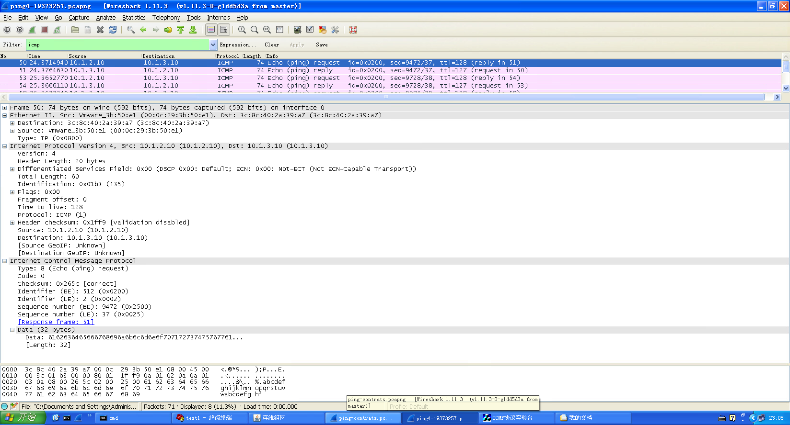
>
> 第一条ICMP回送应答报文：
>
> 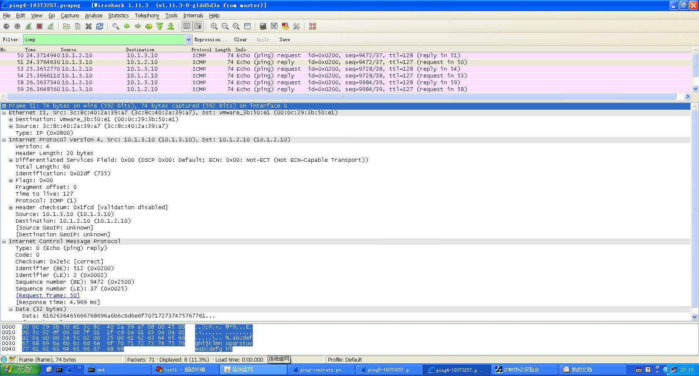
>
> 一共有8个ICMP报文，其中四个为回送请求报文，四个为回送应答报文。
>
> 种类字段名：Type，代码字段名：Code。
>
> 通过Sequence number (BE) 和Sequence number (LE) 字段可保证回送请求和回送应答报文一一对应。

运行PCA和PCB的wireshark，打开pingtest软件，如下配置，点击发送：

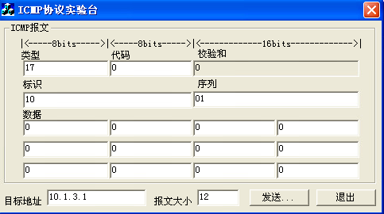

然后看一下报文截获情况，先不要停止，继续使用pingtest软件如下配置和发送：注意这次目标地址是10.1.3.10，和之前不一样。

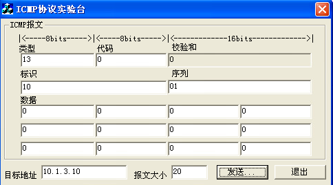

接着就可以停止截获，保存报文信息，做以下分析：

> 题7：（第一次pingtest-两个ICMP）
>
> 答：PCA报文截获情况如下：
>
> 地址掩码请求报文：
>
> 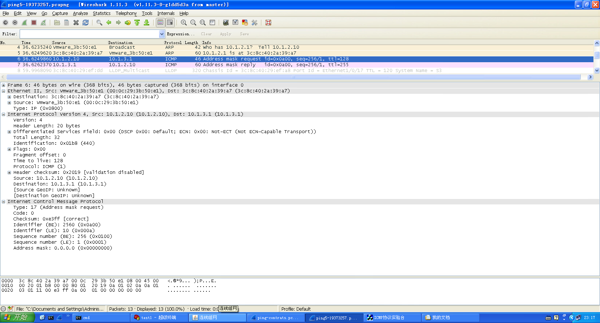
>
> 地址掩码应答报文：
>
> 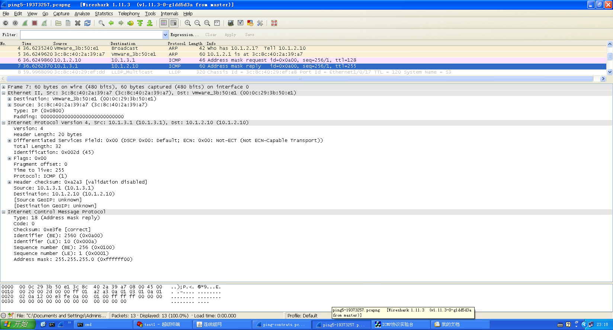
>
> | 地址掩码请求报文    |        | 地址掩码应答报文    |        |
> | ------------------- | ------ | ------------------- | ------ |
> | ICMP字段名          | 字段值 | ICMP字段名          | 字段值 |
> | Type                |        | Type                |        |
> | Code                |        | Code                |        |
> | Checksum            |        | Checksum            |        |
> | Identifier(BE)      |        | Identifier(BE)      |        |
> | Identifier(LE)      |        | Identifier(LE)      |        |
> | Sequence number(BE) |        | Sequence number(BE) |        |
> | Sequence number(LE) |        | Sequence number(LE) |        |
> | Address mask        |        | Address mask        |        |

> 题8：第二次pingtest（第二次pingtest）
>
> PCA时间戳请求报文：
>
> 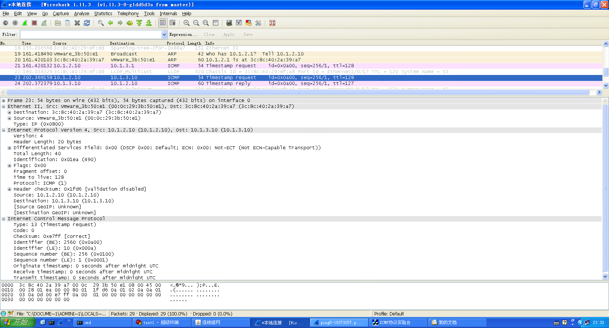
>
> PCA时间戳应答报文：
>
> 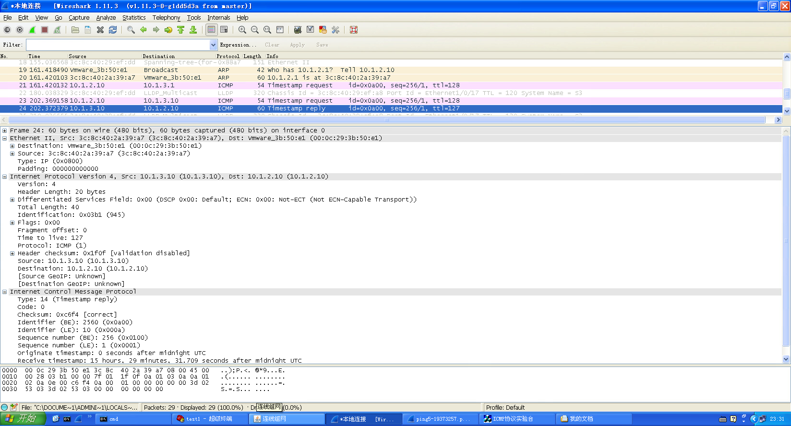
>
> | 地址掩码请求报文    |        | 地址掩码应答报文    |        |
> | ------------------- | ------ | ------------------- | ------ |
> | ICMP字段名          | 字段值 | ICMP字段名          | 字段值 |
> | Type                |        | Type                |        |
> | Code                |        | Code                |        |
> | Checksum            |        | Checksum            |        |
> | Identifier(BE)      |        | Identifier(BE)      |        |
> | Identifier(LE)      |        | Identifier(LE)      |        |
> | Sequence number(BE) |        | Sequence number(BE) |        |
> | Sequence number(LE) |        | Sequence number(LE) |        |
> | Originate timestamp |        | Originate timestamp |        |
> | Receive timestamp   |        | Receive timestamp   |        |
> | Transmit timestamp  |        | Transmit timestamp  |        |
>
> ICMP询问报文的作用：ICMP询问报文可以主动与目标主机交换一些必要的信息（例如地址掩码、时间），以达到通信前协商的效果。

类似地，重新运行PCA和PCB的wireshark，然后在PCA中：

```shell
$ ping 10.1.3.20
$ ping 10.1.4.10
```

自然是ping不通的，但能截获到报文。同样的保存报文信息。

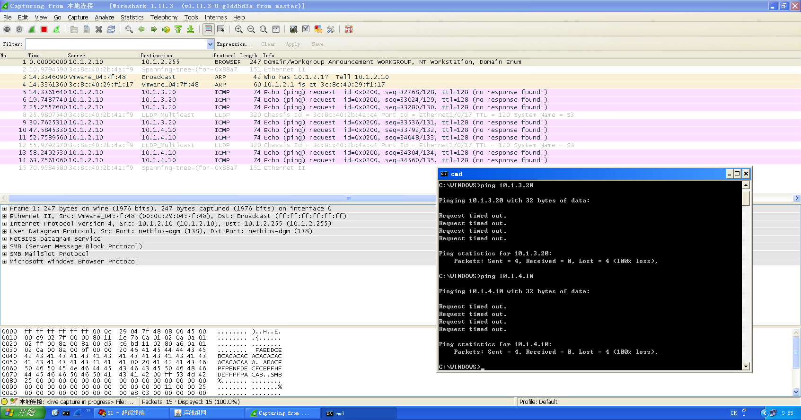

这里，在新设备上操作，没法像慕课一样能在cmd上就区分开（慕课操作截图如下）。对于新设备，两种情况从PCA上几乎看不出差别，都显示timed out；在PCB上，可以看到ping 10.1.3.20时，交换机发出了arp request报文，请求10.1.3.20主机的MAC地址，但交换机没有给PCA反馈任何信息。而ping 10.1.4.10没有任何反馈信息。

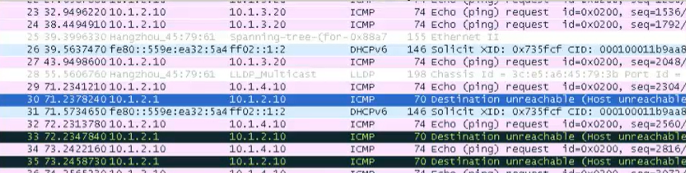

简单解释一下，在PCA上执行 ping 10.1.3.20和ping 10.1.4.10，目的是ping一个可到达网段的不存在的主机，以及ping一个不可达网段上的不存在的主机。希望PCA能够分别收到“主机不可达”和“网络不可达”两种ICMP差错报文。

PCA ping 10.1.3.20，没有收到“主机不可达”的ICMP差错报文，老师认为有安全性和减轻交换机负担两方面的考虑。例如，对于主机扫描等网络攻击行为，逐条回应主机不可达报文，会消耗交换机的资源。同时，回应报文也容易泄露交换机的ip地址，使其容易受到攻击。

因此，交换机只是发送若干arp request报文，在规定的时间段内如果没有收到应答报文，就会丢弃ICMP request报文。并不发送icmp主机不可达报文。

> 题9：
>
> (1) 请比较这两种情况有何不同？
>
> 答：
>
> (2) 截获了哪种ICMP差错报文？其类型和代码字段值是什么？此报文的ICMP协议部分又分为了几部分？其作用是什么？
>
> [截图×2]
>
> 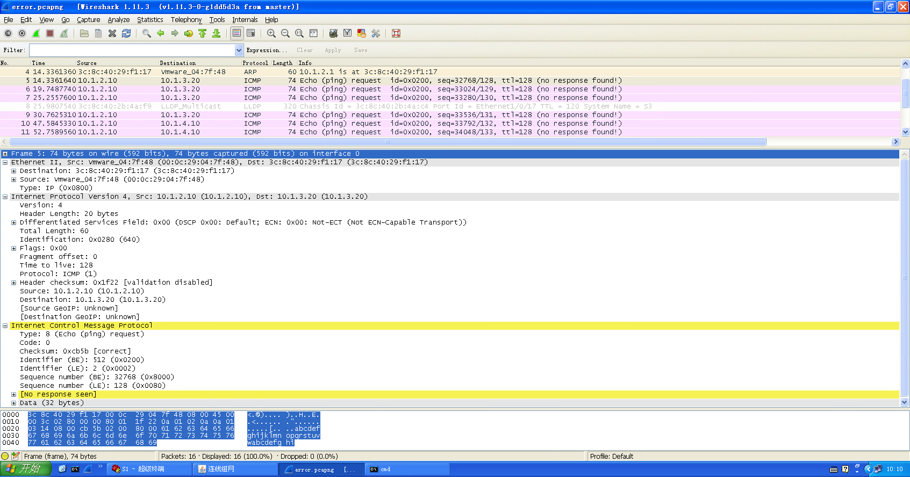
>
> 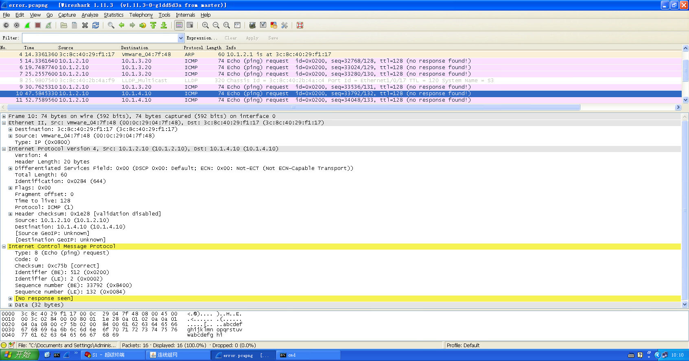
>
> 答：
>

取消PCA上的DNS配置，我一开始没配置所以不需要做改动了。新设备由于安全性，默认对tracert命令不回应，所以需要在PCA超级终端中输入以下命令打开响应：

```shell
[S1]ip ttl-expires enable
[S1]ip unreachables enable
```

PCA和PCB启动WireShark截获，在PCA的cmd中执行`tracert 10.1.3.10`，将PCA截获的报文信息保存，进行分析。

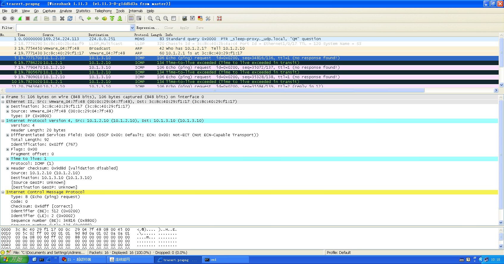

> 题10：
>
> (1) 结合报文内容，简述tracert的工作过程。
>
> 答：tracert会先向目标发出一个TTL=1的包，由于包每一次转发都有TTL-=1，因此转发一次后如果没到达目的地，则TTL=0，转发的主机会丢弃这个包，并往发送的主机发出一条ICMP差错控制报文（超时）。发送的主机会根据这个报文获取到途径的路由器的地址。接下来发送的主机再发送一个TTL=2的包，其它操作同上。直到TTL足够大以至于可到达目标，目标将会返回ICMP回送应答报文。
>
> (2) 截获了哪种ICMP差错报文？其类型和代码字段值是什么？
>
> 答：截获ICMP差错报文的类型为超时。Type：11，Code：0。
>
> 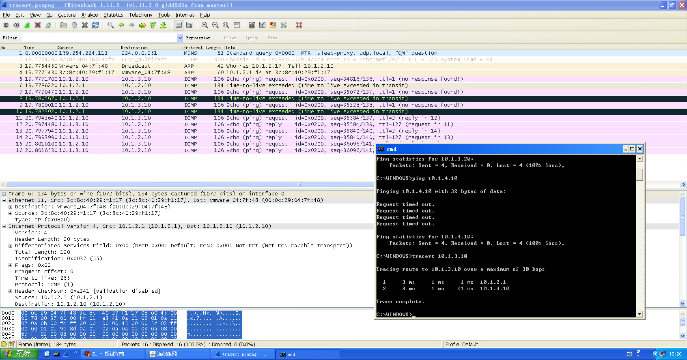
>
> ICMP差错报文内容：
>
> 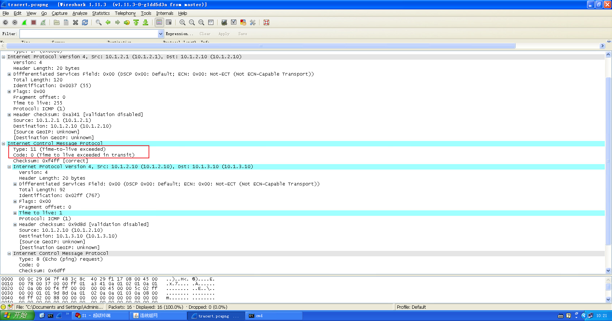

### IP报文分析

组网图与前面步骤相同。

> 题11：根据4.6中步骤1，写出tracert命令用到了IP协议报文的哪几个字段？
>
> 答：Time to live字段。

#### 步骤2

将PCA的子网掩码设置为255.255.0.0，在PCA和PCB启动报文截获，然后PCA ping PCB，即在PCA中输入ping 10.1.3.10。ping不通，截图。

> 题12：根据4.6中步骤2回答：观察PCA和PCB能否ping通，结合截获报文分析原因。
>
> 答：此时PCA会认为PCB和他在同一个网络中，因此会直接发送ARP请求来询问PCB的MAC地址，然而并没有主机回复。因此PCA会放弃发送，ping失败。
>
> 

#### 步骤3

将PCA的子网掩码恢复为255.255.255.0，执行下列命令查看路由表信息：

```shell
[H3C]display ip routing-table
```

截图，填表。

> 题13：
>
> 答：[截图] and 填表
>
> 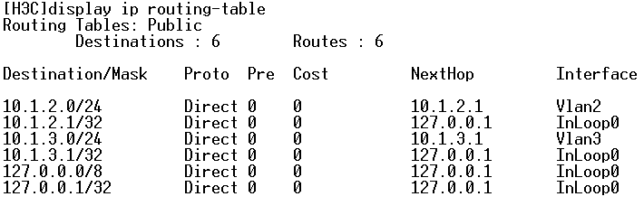

#### 步骤6

按照实验二的5.5节（PPP实验）配置路由器，两个路由器互相ping，看能否ping通。

该步骤对应题14，不建议做，没写步骤，有点复杂，直接抄。放不放截图都可以。

想做的朋友，给你列出教程来了：

实验指导文档教材：

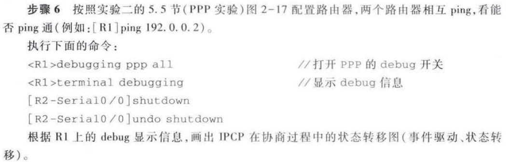

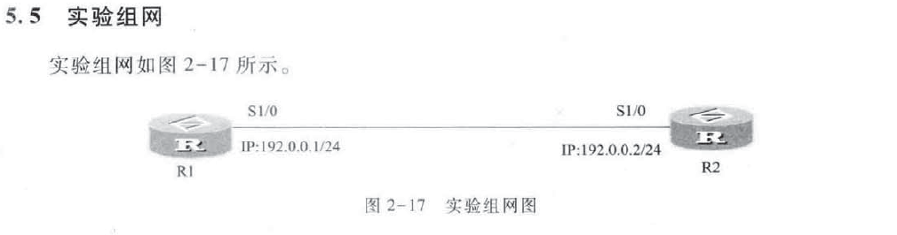

> 题14：
>
> (1) 能ping通。
>
> lkw流程图：
>
> 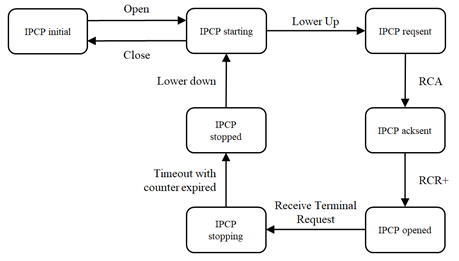
>
> zyh流程图：
>
> 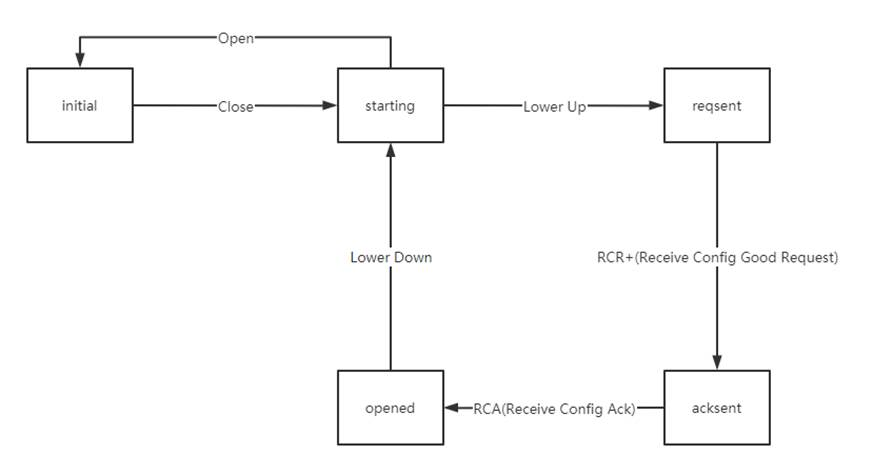
>
> 截图（可放可不放）：
>
> R2 ping R1：
>
> 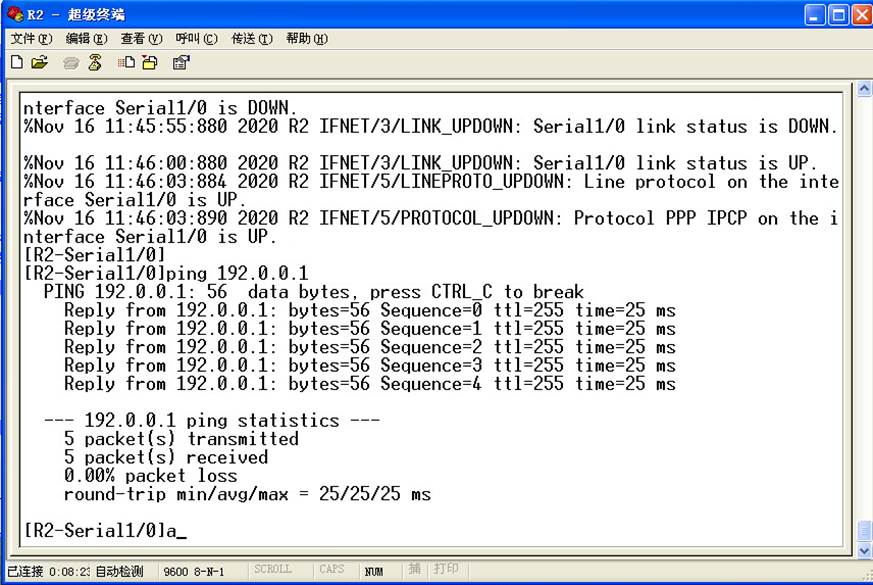
>
> R1 ping R2：
>
> 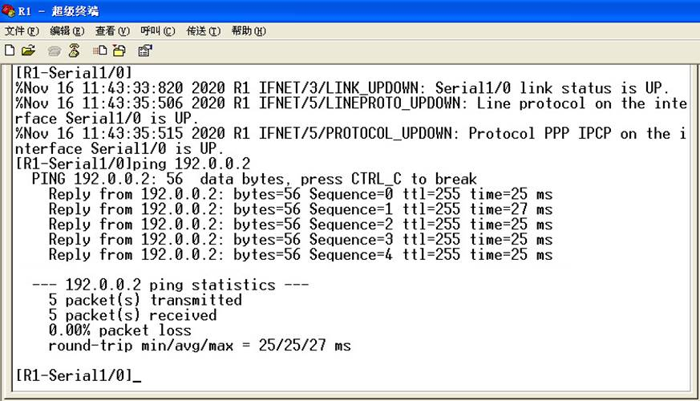
>
> (2) 答：两台路由器能ping通。 因为IPCP会协议IP连接的模块，并分配上网所需的参数。当R2的地址发生了修改，IPCP会重新执行刚才的协商，并最终修改适当的参数，使得两个路由器之间连通，所以能ping得通。
>
> [截图]
>
> 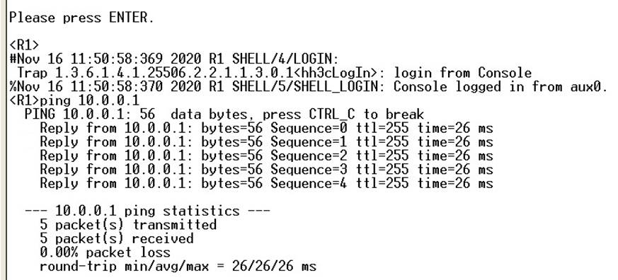

### 网络层分片实验

对应选做题15。自己看做不做。

清空连线组网，即一键还原，然后按下图连线。连接后提交。

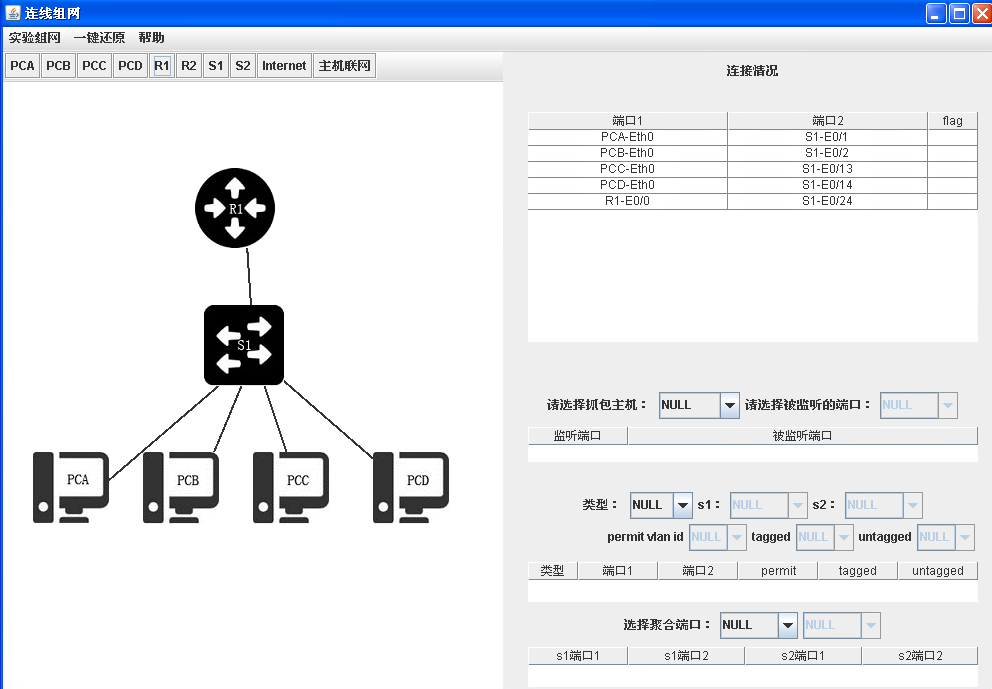

根据下图修改四个机子的IP。默认网关不填。

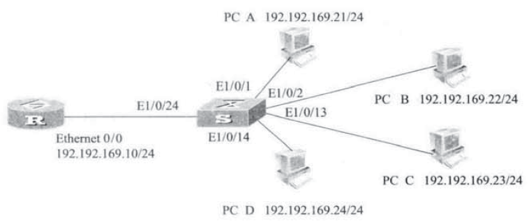

在PCC打开R1超级终端，输入：

```shell
<R1>sys
[R1]inter ethernet 0/0
[R1-Ethernet0/0]mtu 100
[R1-Ethernet0/0]ip add 192.192.169.10 255.255.255.0
```

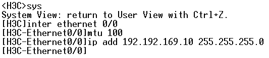

接着打开PCA-D的WireShark软件，使用前需要先设置一下。

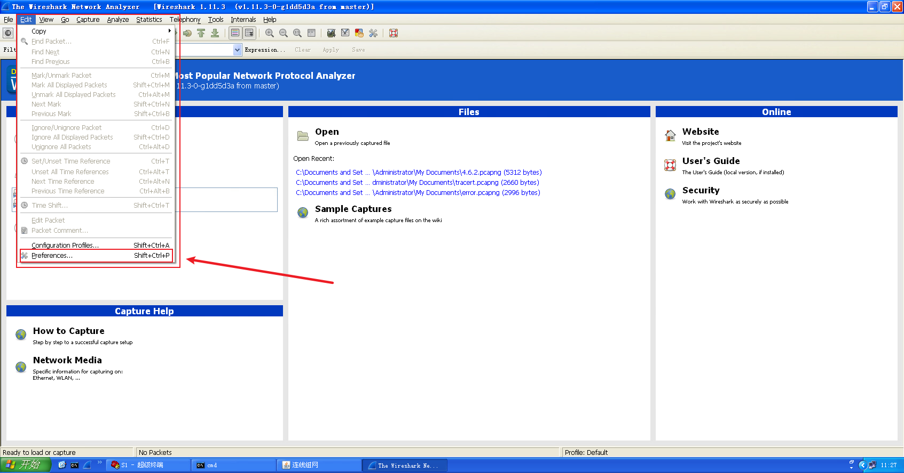

打开preferences后，左侧导航栏展开Protocols，找到IPv4，若Reassemble fragmented..被勾选了的话，要去掉勾选。然后点击apply，再OK。

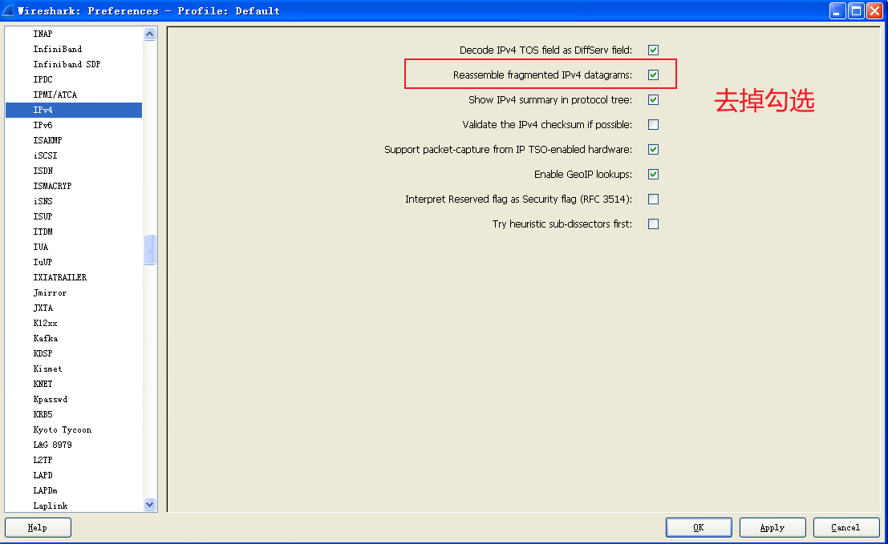

PCA-PCD都如上操作。然后开始截获。

然后在PCC的R1超级终端中，输入以下命令执行ping：

```shell
ping -s 300 192.192.169.21
ping -s 300 192.192.169.22
ping -s 300 192.192.169.23
ping -s 300 192.192.169.24
```

然后到PCB去保存报文信息，实验中要求保存为”fragment-学号“并上传至FTP服务器的”网络实验/网络层实验“目录下，不过老师说不是必须的。——听君一席话

截图报文信息。

> 题15：
>
> (1) 答：ARP 2个，ICMP:Echo 10个，ICMP Reply 5个，IP报文 15个。
>
> 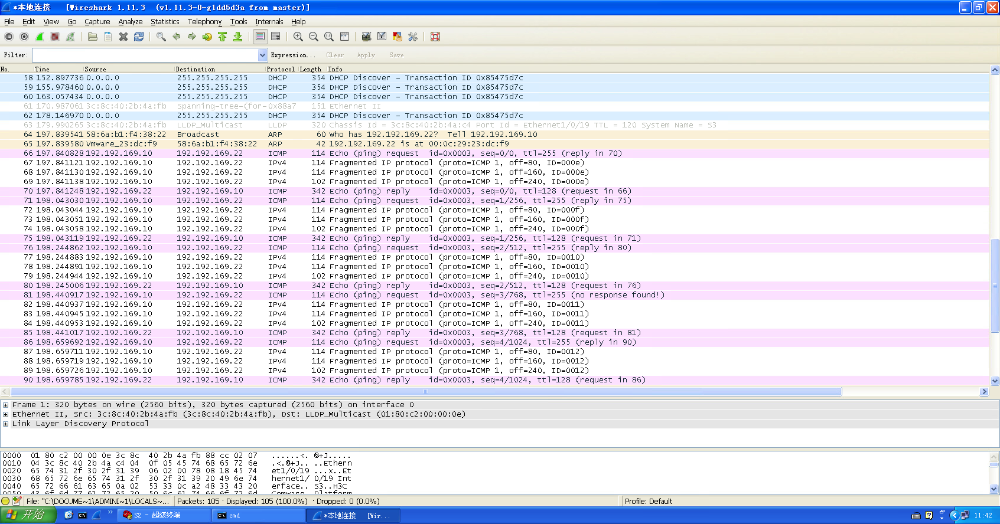
>
> (2) 题目中不展示截图了，直接填表。截图见表后。
>
> 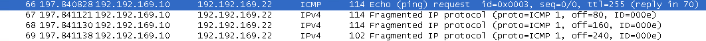
>
> | 字段名称               | 分片序号1  | 分片序号2  | 分片序号3  | 分片序号4  |
> | ---------------------- | ---------- | ---------- | ---------- | ---------- |
> | “Identification”字段值 | 0x000e(14) | 0x000e(14) | 0x000e(14) | 0x000e(14) |
> | “Flag”字段值           | 0x01       | 0x01       | 0x01       | 0x00       |
> | “Frame offset”字段值   | 0          | 80         | 160        | 240        |
> | 传输的数据量           | 80bytes    | 80bytes    | 80bytes    | 68bytes    |


### VLAN间路由实验

对应题目16，抄

### 设计型实验

模仿前人做的。

子网的数量：6，子网掩码均为：255.255.255.224，详细情况如下：

| 序号 |      网关       |           主机地址范围            |
| :--: | :-------------: | :-------------------------------: |
|  1   | 202.108.100.33  |  202.108.100.34 – 202.108.100.62  |
|  2   | 202.108.100.65  |  202.108.100.66 – 202.108.100.94  |
|  3   | 202.108.100.97  | 202.108.100.98 – 202.108.100.126  |
|  4   | 202.108.100.129 | 202.108.100.130 – 202.108.100.158 |
|  5   | 202.108.100.161 | 202.108.100.162 – 202.108.100.190 |
|  6   | 202.108.100.193 | 202.108.100.194 – 202.108.100.222 |

连线组网：

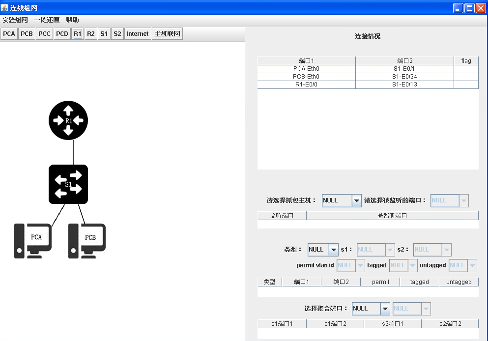

在S1中配置VLAN：

```shell
vlan 2
port e1/0/1
int vlan 2
ip add 202.108.100.1 27
vlan 3
port e1/0/24
int vlan 3
ip add 202.108.100.225 27
int vlan 1
ip add 211.100.217.193 24
```

在R1中配置：

```shell
int GigabitEthernet0/0
ip add 211.100.217.192 24
ip route-static 202.108.100.0 24 211.100.217.193
```

PCA的IP：

- IP：202.109.100.34
- 子网掩码：255.255.255.224
- 默认网关：202.109.100.33

PCB的IP：

- IP：202.109.100.222
- 子网掩码：255.255.255.224
- 默认网关：202.109.100.193

用PCA来ping 211.100.217.192：

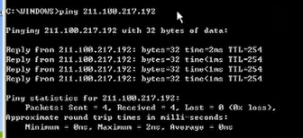

用PCB来ping 211.100.217.192：

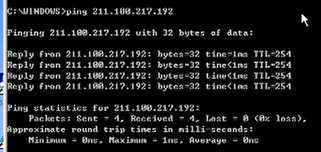

符合实验要求。

