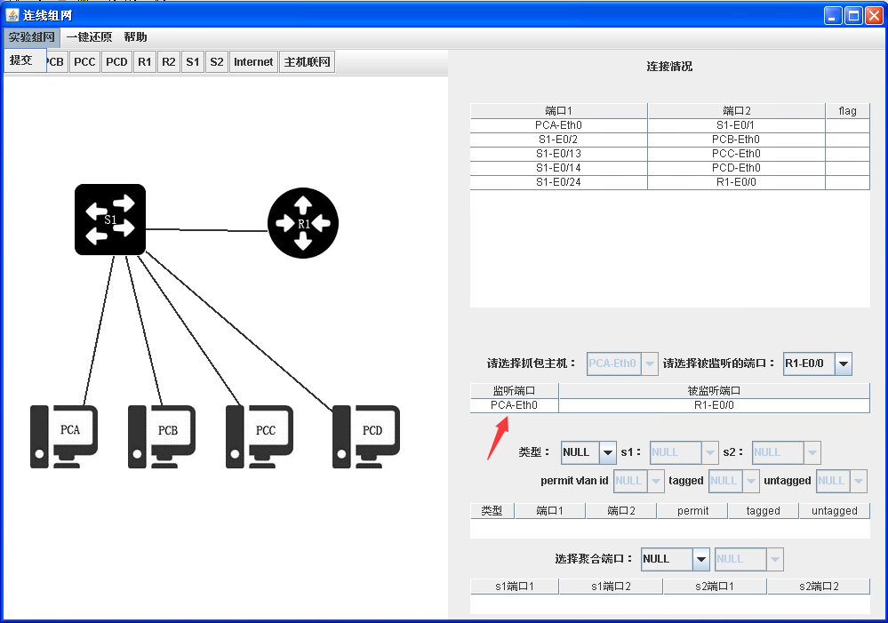
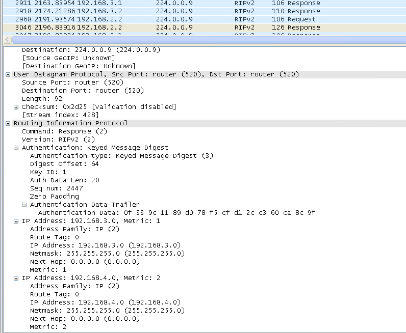

## RIP 实验

> 作者：郝泽钰

实验开始前，清空上一个人的配置（） 四台电脑都要开

### 实验1 静态路由

连线组网：


配置 S1

```sh
sys
vlan 2
port e1/0/17 to e1/0/24
in v 1
ip ad 192.168.2.1 255.255.255.0
in v 2
ip ad 192.168.1.1 255.255.255.0
```

配置 R1

```sh
sys
in e0/0
ip ad 192.168.1.2 24
```

展示路由表，截图(R1上)(题1)：

```sh
di ip r
```


配置 PCA 的地址：


配置完成后在 R1 超级终端上 ping PCA 发现不同，截图（题1）


R1 上添加静态路由，重新打表并截图（题2）：

```sh
ip rou 192.168.2.0 255.255.255.0 192.168.1.1
di ip r
```


此时可以 ping 通，截图：


取消静态路由，添加静态路由，重新查表：

```
un ip rou 192.168.2.0 255.255.255.0 192.168.1.1
ip rou 0.0.0.0 0 192.168.1.1
dis ip r
```


此时仍然可以 ping 通


### 实验2 RIP 配置， RIPv1 报文结构分析

重新组网：

（建议 实验2 之前再次清空配置）

（实验2 - 实验6 是连贯的，中间不用清空）



截获报文（PCA）：


在 R1 上配置：

```sh
rip
net 192.168.1.0
```

在 S1 上配置：

```
rip
net 192.168.1.0
net 192.168.2.0
```

配完后已经抓到包可以分析了，不过先去 R1 上输出路由表并 ping 一下PCA，截个图（题5）：


可以发现多了一条 RIP 协议的路由信息。

回到 PCA查看抓包结果，选 request 截图（题8）


其余的题抄抄抄就完事了

### 实验3 距离矢量算法分析

重新组网：


在 PCB 上开始截包。


在 S1 上配置：

```
in v 1
ip ad 192.168.2.1 24
in loop 1
ip ad 192.168.1.1 32
rip
net 192.168.2.0
net 192.168.1.0
```

S2:

```
in v 1
ip ad 192.168.3.2 24
rip
net 192.168.3.0
```

R1:

```
in e0/0
ip ad 192.168.2.2 24
in e0/1
ip ad 192.168.3.2 24
rip
net 192.168.2.0
net 192.168.3.0
```

在 PCB 上抓包，找 response：


重新组网，和上图完全一样，用 PCB监听 R1-E0/1 

组好后再找一个response截图：


（两个 ，Metric 分别是 1 和 2，10题的图）


在 S2 上如下操作：

```
in loop 2
ip add 192.168.4.1 32
rip
net 192.168.4.0
net 192.168.3.0
```

然后分别在R1,S1中执行

```
dis ip r
```

截图（11题）

### 实验4 

没有图

所以。。。

### 实验5

按顺序配置：

S1

```
in vlan 1
rip v 2
rip au md5 rfc2082 buaa 1
in loo 1
rip v 2
rip au md5 rfc2082 buaa 1
```

S2

```
in vlan 1
rip v 2
rip au md5 rfc2082 buaa 1
```

R1

```
in e0/0
rip v 2
rip au md5 rfc2082 buaa 1
in e0/1
rip v 2
rip au md5 rfc2082 buaa 1
```

然后去 PCB 抓 RIPv2 的包，截图



### 实验6 RIP 组网设计实验

困了，没做（）