# 传输层实验

> 作者：周勤

## MOOC上的内容

**对于路由器、交换机，实验前都需要先清空设置，下文将不再说明**

**本次实验大部分在Linux上完成，小部分在Windows上完成**

### Pre Linux配置IP地址的方法

鼠标右键点击托盘区网络图标，并点击Edit Connections：

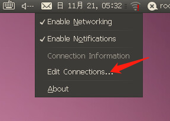

点击Add按钮，在IPv4设置中设置IP地址、网关等，然后依次点击Apply和OK：

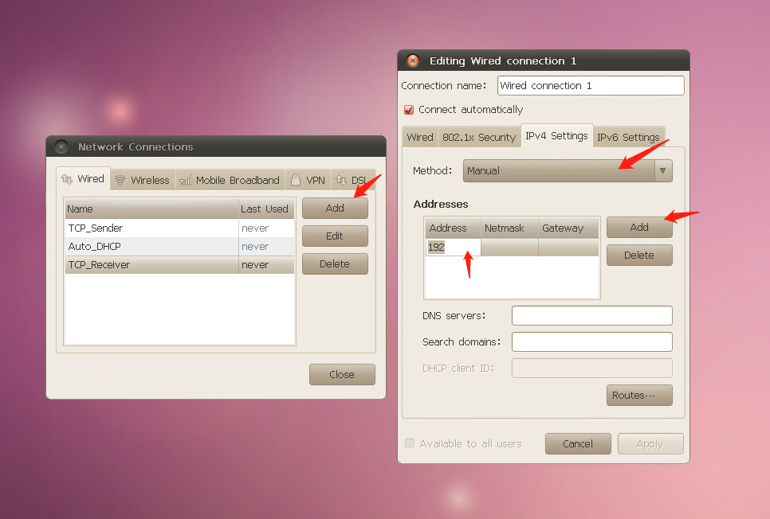

需要使用对应的配置时，需要先在右上角点击Disconnect断开原有连接，再在右上角选择对应的配置进行连接：

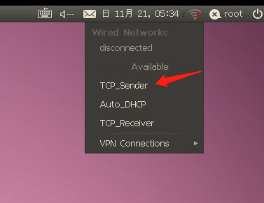

### 步骤1 配置路由器和交换机

连接到服务器后，登录Linux虚拟机，用户名root，密码network，在PCA的桌面找到并打开连线组网软件。

由于是Java写的程序，所以跨平台做的比较好，如下图连线组网并且提交即可（连线组网可能比较慢，请耐心等待，如果遇到白屏和打不开等问题，大概率是后端炸了）：

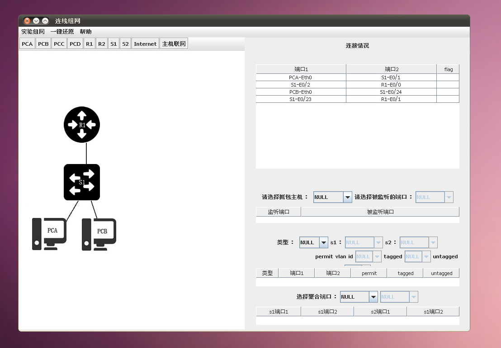

打开PCC配置R1，打开终端输入minicom命令，进入超级终端。

**需要注意的是，打开了之后，千万不要关闭monicom终端，不过可以最小化，其他程序也建议不要关**

根据如下的命令配置R1的IP地址即可（如果GigabitEthernet用不了，可以用Ethernet）：

```sh
sys
interface GigabitEthernet 0/0
port link-mode route
ip address 192.168.1.1 255.255.255.0
interface GigabitEthernet 0/1
port link-mode route
ip address 192.168.2.1 255.255.255.0
```

打开PCA配置S1，同样打开终端输入minicom命令，进入超级终端。

**需要注意的是，打开了之后，千万不要关闭monicom终端，不过可以最小化，其他程序也建议不要关**

进入超级终端后，需要配置IP地址和两个VLAN，配置命令如下：

```sh
sys
vlan 2 to 3
interface Ethernet 1/0/1
port access vlan 2
interface Ethernet 1/0/2
port access vlan 2
interface Ethernet 1/0/23
port access vlan 3
interface Ethernet 1/0/24
port access vlan 3
```

在虚拟机中，PCA和PCB的IP地址都已经配好了，只需要在**托盘区**点击网络图标进行选择并连接即可。PCA需要选择TCP_Sender，PCB需要选择TCP_Receiver：

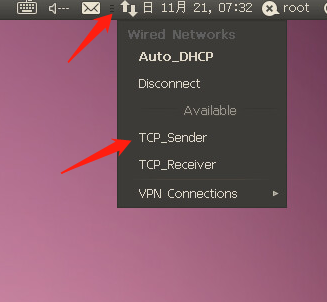

如果机器没有预先配好，则需要按照**Pre**中的步骤进行配置，实验组网图如下：

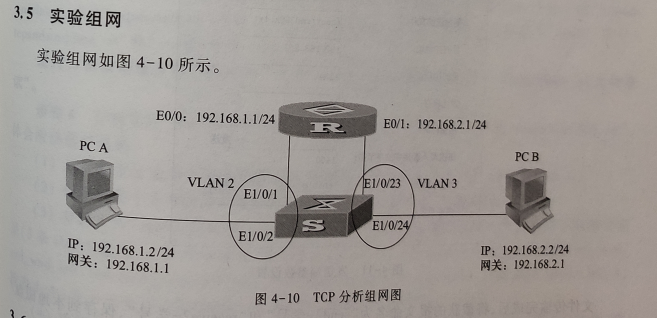

都连接好之后可以使用ping命令验证一下连接性，还可以用`ifconfig`命令验证IP地址的配置。

### 步骤2 启动Wireshark和TcpTest

在PCB打开Wireshark，监听Eth0口，过滤器填写tcp，点击Apply：

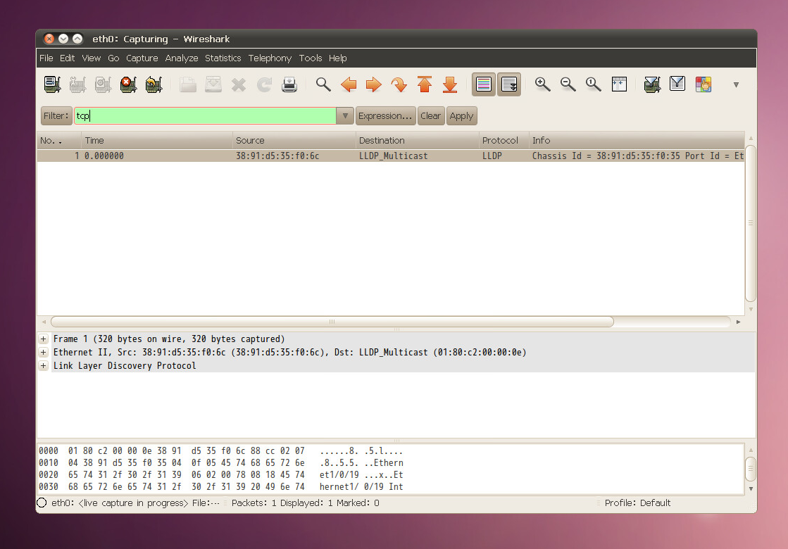

在PCB的桌面打开TcpTest，点击作为接收端，将计数阈值改为0，然后点击接收：

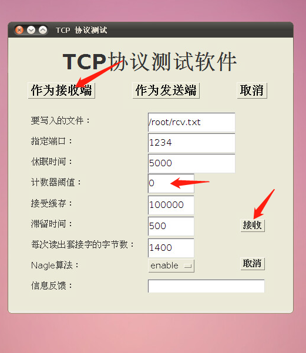

在PCA中，同样打开并设置Wireshark，打开Wireshark之后，需要在桌面上先运行`tcplog_init`脚本：

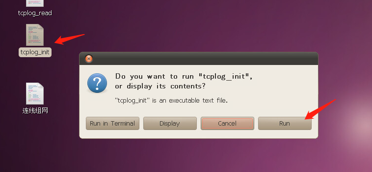

然后，PCA再打开TcpTest，点击作为发送端，发送文件修改为下图所示的300k大小的文件，然后点击发送：

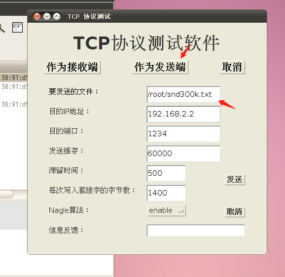

### 步骤3 报文截图与分析

等待文件发送完毕后，停止PCA和PCB的抓包，保存或截图PCA和PCB的抓包记录。（关于FTP服务器的使用见下文）

保存或截图之后，可以对TCP三次握手，四次挥手，以及中间过程进行分析，并填写实验报告。

### 步骤4 分析Linux内核数据

在Wireshark停止抓包之后，在PCA的桌面上点击并运行`tcplog_read`脚本：

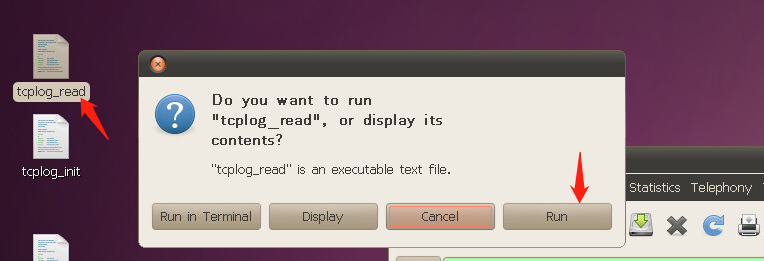

然后在PCA的`/root`目录下，进入`TCPLog`文件夹，保存或截图如下文件，该文件记录了Linux内核Tcp协议栈的参数。（关于FTP服务器的使用见下文）

保存或截图之后，进行分析并填写实验报告即可：

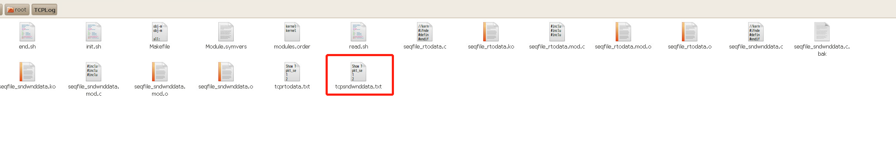

### Ex 虚拟机连接外网

需要注意的是，建议做完所有实验再将实验数据一起发回（再连接外网），这样不用重复连线组网，因为后面的实验和前面的组网相同。

进入PCA的连线组网程序，点击主机联网：

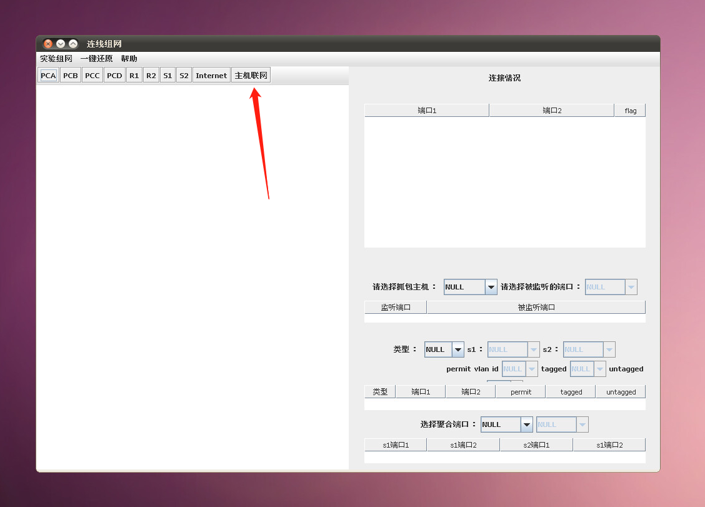

接下来需要使用DHCP获取主机地址，在托盘区点击这个图标，选择Auto_DHCP即可（若没有这个配置，则可以自行配置DHCP）：

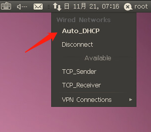

配置完之后，可以使用`ifconfig`命令来进行验证，还可使用`ping 10.111.1.29`命令来验证与FTP服务器的连通性（对于PCB这样的多网卡机器，可以使用`ifconfig eth1 down`命令来关闭网卡1，防止网卡1的干扰）：

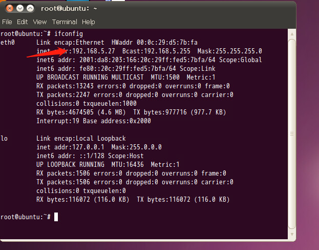

若使用FTP传输文件，则这时就可以点击托盘区的gFTP图标，打开gFTP程序。

输入FTP服务器的地址，协议选择FTP，点击电脑图标进行连接后，就可以上传到自己的文件夹了：

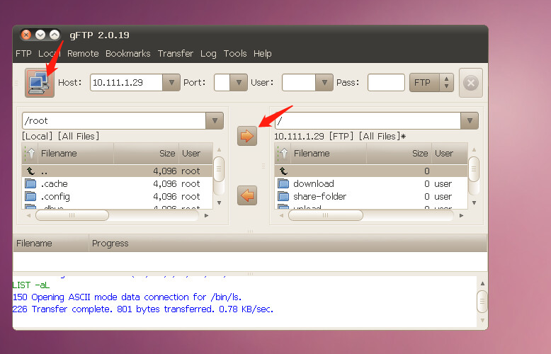

另外，还可以通过发送邮件等方式将数据发回本机，因为都连接外网了，所以可以乱搞，但是由于配置原因，所以这样可能稍微卡一些。

## 还需要做的内容

还需要再进行10Mbps转发速率实验、100Kbps转发速率实验、UDP实验。

需要注意的是，转发速率实验组网和前面相同，而**UDP实验**需要在**WindowsXP**系统上才能进行。

这三部分内容，实验指导书讲得比较详细了，我这里放几张实验指导书的截图：

### 转发速率实验

继续在PCA和PCB上进行实验即可，**如果之前关闭了minicom，则到这一步时可能会出现minicom打不开的问题**。

注意：

1. 如果原来进入的是GigabitEthernet接口，则下面的实验也需要进入GigabitEthernet
2. 若遇到TcpTest报错“I/O错误”，重启TcpTest即可

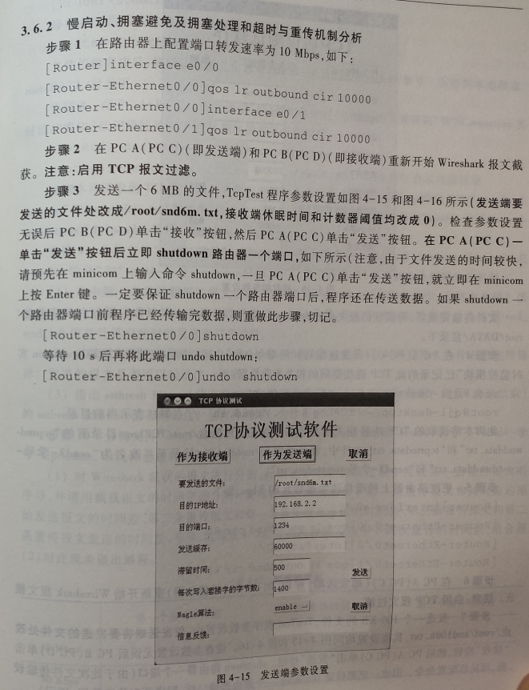

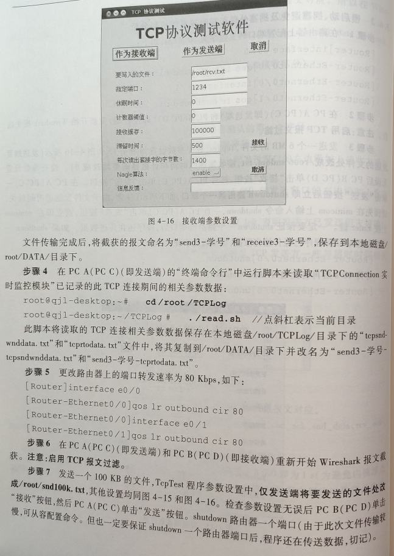


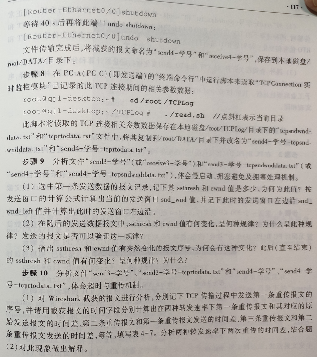

### UDP实验

这个实验需要在WindowsXP上进行，所以需要预约WindowsXP：

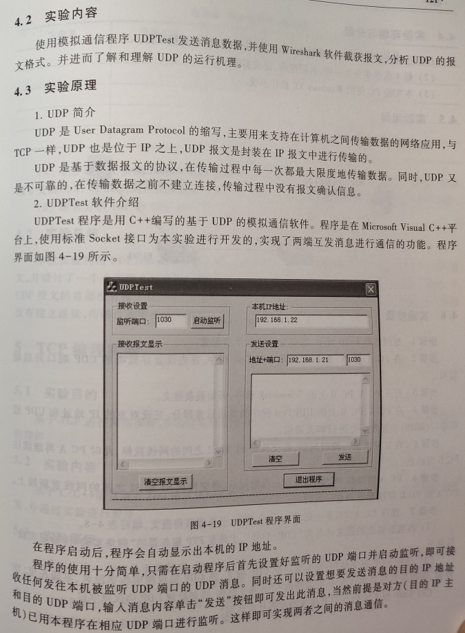

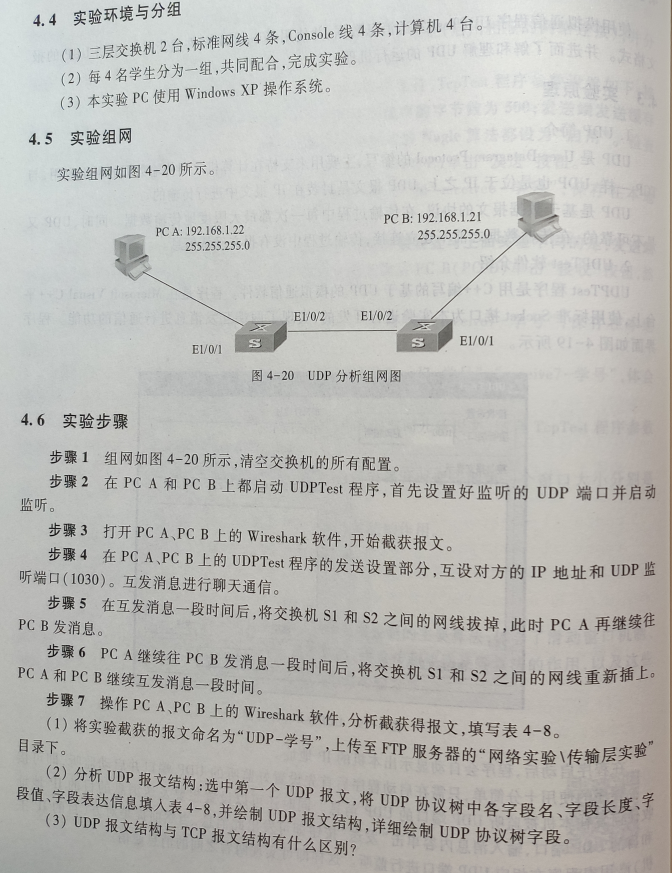


本实验截图较少，也比较简单做，我的截图如下：

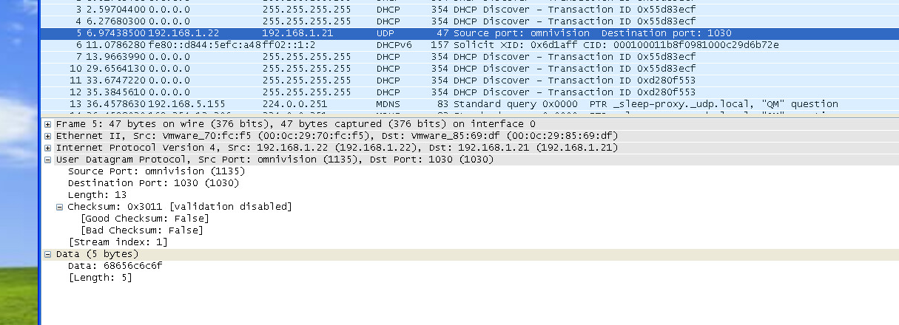